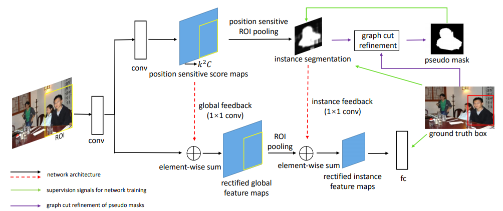
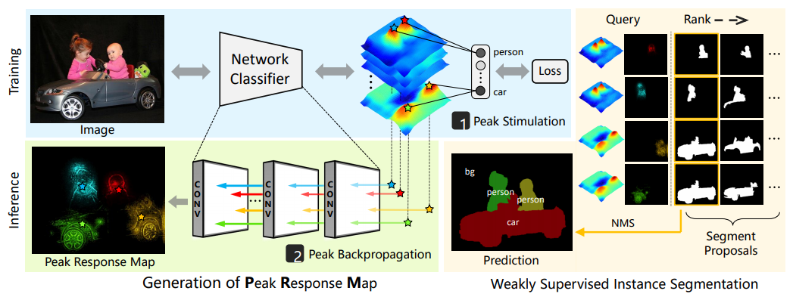

# Weakly Supervised Semantic Segmentation list

This repository contains lists of state-or-art weakly supervised semantic segmentation works. Papers and resources are listed below according to supervision types. 

There are some personal views and notes, just ignore if not interested. (keep updating)

- [x] Paper list
	- [x] instance
	- [x] box
	- [x] one-shot
	- [x] others 
- [x] Resources

some unsupervised segment proposal methods and datasets [here](unsup.md).

#### Typical weak supervised segmentation problems 

| No | Supervision | Difficulty | Domain | Core issues |
| -- | ----------- | ---------- | ------ | ----------- |
| 1 | [Bounding box](#1) | middle | annotated classes | transfer learning |
| 2 | [One-shot segment](#2) | middle | similar objects | one-shot learning |
| 3 | [Image/video label](#3) | hard | annotated classes | transfer learning |
| 4 | [Others](#4) | n/a | n/a | n/a |

<h2 id="1">1.Bounding box supervision</h2>

Instance semantic segmentation

* [Learning to Segment Every Thing](https://arxiv.org/abs/1711.10370), CVPR 2018

	:Learning weight transfer from well-annotated subset, transfer class-specific weights(output layers) from detection and classification branch, based on Mask-RCNN

* [Pseudo Mask Augmented Object Detection](https://arxiv.org/abs/1803.05858), CVPR 2018

	:State-of-art weakly supervised instance segmentation with bounding box annotation. EM optimizes pseudo mask and segmentation parameter like Boxsup. Graphcut on superpixel is employed to refine pseudo mask. 

* [Simple Does It: Weakly Supervised Instance and Semantic Segmentation](https://arxiv.org/abs/1603.07485), CVPR 2017 \[[web](https://www.mpi-inf.mpg.de/departments/computer-vision-and-multimodal-computing/research/weakly-supervised-learning/simple-does-it-weakly-supervised-instance-and-semantic-segmentation/)\] \[[ref-code](https://github.com/philferriere/tfwss)\]\[[supp](http://openaccess.thecvf.com/content_cvpr_2017/supplemental/Khoreva_Simple_Does_It_2017_CVPR_supplemental.pdf)\]

	:Grabcut+(HED bounday) and MCG , train foreground segmentation network directly with generated mask semantic segmentaion, sensitive to env(quality) of training images. Check [my implementation](https://github.com/JackieZhangdx/PseudoMask) for pseudo mask generation which is similar to Grabcut+ MCG. But it can't match the performance discribed in paper sup. Opencv version Grabcut perform even worse.

* [Weakly- and Semi-Supervised Learning of a DCNN for Semantic Image Segmentation](https://arxiv.org/abs/1502.02734), ICCV 2015

	:Based on CRF refine, EM seems not work

* [BoxSup: Exploiting Bounding Boxes to Supervise Convolutional Networks for Semantic Segmentation](https://arxiv.org/abs/1503.01640), ICCV 2015

	:Iteratively update parameters and region proposal labels, proposals are selected by network output masks

* [Deepcut: Object segmentation from bounding box annotations using convolutional neural networks](https://pdfs.semanticscholar.org/9732/f55c55512309e24a88ae4f0728cc763b626f.pdf), TMI 2017

Arxiv paper

* [Learning to Segment via Cut-and-Paste](https://arxiv.org/abs/1803.06414), Arxiv 1803 

* [Adversarial Learning for Semi-Supervised Semantic Segmentation](https://arxiv.org/abs/1802.07934), Arxiv1802, \[[code](https://github.com/hfslyc/AdvSemiSeg)\]

<h2 id="2">2.One-Shot segmentation supervision</h2>

DAVIS Challenge: <http://davischallenge.org/> 

	: Davis17/18(Semi-supervised Video segmentation task), Davis16 is video salient object segmentation without the first frame annotations.

* [Fast and Accurate Online Video Object Segmentation via Tracking Parts](https://arxiv.org/abs/1806.02323), CVPR 2018 \[[code](https://github.com/JingchunCheng/FAVOS)\]

	:state-of-art, 82.4%/1.8s 77.9%/0.6s 

* [OSVOS: One-Shot Video Object Segmentation](http://openaccess.thecvf.com/content_cvpr_2017/papers/Caelles_One-Shot_Video_Object_CVPR_2017_paper.pdf), CVPR 2017 \[[web](http://www.vision.ee.ethz.ch/~cvlsegmentation/osvos/)\]\[[code](https://github.com/kmaninis/OSVOS-caffe)\]
	
	:milestone, fine-tuning parent network with the first frame mask, 79.8%/10s

<h2 id="3">3.Image/video label supervision</h2>

* [Weakly Supervised Instance Segmentation using Class Peak Response](https://arxiv.org/abs/1804.00880), CVPR 2018

	:state-of-art practice for instance seg with only class label.

* [Revisiting Dilated Convolution: A Simple Approach for Weakly- and SemiSupervised Semantic Segmentation](https://arxiv.org/abs/1805.04574), CVPR 2018

* [Adversarial Complementary Learning for Weakly Supervised Object Localization](https://arxiv.org/abs/1804.06962v1), CVPR 2018

* [Learning Pixel-level Semantic Affinity with Image-level Supervision for Weakly Supervised Semantic Segmentation](https://arxiv.org/abs/1803.10464), CVPR 2018

* [Multi-Evidence Filtering and Fusion for Multi-Label Classification, Object Detection and Semantic Segmentation Based on Weakly Supervised Learning](https://arxiv.org/abs/1802.09129), CVPR 2018

* [Weakly Supervised Semantic Segmentation using Web-Crawled Videos](https://arxiv.org/abs/1701.00352), CVPR 2017 \[[web](http://cvlab.postech.ac.kr/research/weaksup_video/)\]

* [Object Region Mining with Adversarial Erasing: A Simple Classification to Semantic Segmentation Approach](https://arxiv.org/abs/1703.08448), CVPR 2017

* [WILDCAT: Weakly Supervised Learning of Deep ConvNets for Image Classification, Pointwise Localization and Segmentation](http://webia.lip6.fr/~durandt/pdfs/2017_CVPR/Durand_WILDCAT_CVPR_2017.pdf), CVPR 2017 \[[web](http://webia.lip6.fr/~durandt/projects/wildcat/)\]\[[code](https://github.com/durandtibo/wildcat.pytorch)\]

* [Learning random-walk label propagation for weakly-supervised semantic segmentation](https://arxiv.org/abs/1802.00470), CVPR 2017

* [Weakly Supervised Semantic Segmentation Using Superpixel Pooling Network](https://aaai.org/ocs/index.php/AAAI/AAAI17/paper/view/14445/14288), AAAI 2017
 
* [Learning from Weak and Noisy Labels for Semantic Segmentation](http://ieeexplore.ieee.org/document/7450177/), PAMI 2017

* [Learning to Segment Human by Watching YouTube](https://arxiv.org/abs/1710.01457), PAMI 2017

* [Seed, Expand, Constrain: Three Principles for Weakly-Supervised Image Segmentation](https://arxiv.org/pdf/1603.06098.pdf), ECCV 2016 \[[code](https://github.com/kolesman/SEC)\]

* [Constrained Convolutional Neural Networks for Weakly Supervised Segmentation](https://www.robots.ox.ac.uk/~vgg/rg/papers/ccnn.pdf), ICCV 2015 \[[code](https://github.com/pathak22/ccnn)\]

Resource 

* [Yunchao Wei](https://weiyc.github.io) talk in Chinese about [WSL with image label](http://www.iqiyi.com/w_19ru51f0nh.html)

Arxiv paper

* [Learning to Exploit the Prior Network Knowledge for Weakly-Supervised Semantic Segmentation](https://arxiv.org/abs/1804.04882), Arxiv1804

* [Weakly Supervised Object Discovery by Generative Adversarial & Ranking Networks](https://arxiv.org/abs/1711.08174v2), Arxiv 1711
 
<h2 id="3.1">3.1 Deep activation</h2>

| Propagate method | Papers |
| ---------------- | ------ |
| Global Max Pooling(GMP) | Is object localization for free? - Weakly-supervised learning with convolutional neural networks,[CVPR 2015](http://leon.bottou.org/publications/pdf/cvpr-2015.pdf) |
| Global Average Pooling(GAP) | Learning Deep Features for Discriminative Localization [CVPR 2016](https://arxiv.org/abs/1512.04150)|
| Log-sum-exponential Pooling(LSE)| ProNet: Learning to Propose Object-specific Boxes for Cascaded Neural Networks,[CVPR 2016](https://arxiv.org/abs/1511.03776)|
| Global rank Max-Min Pooling(GRP)| WILDCAT, [CVPR 2017](http://webia.lip6.fr/~durandt/projects/wildcat/)|

<h2 id="3.1">3.2 Weakly supervised Detection / Localization(TODO) </h2>

* [Zigzag Learning for Weakly Supervised Object Detection](https://arxiv.org/abs/1804.09466v1), CVPR 2018

<h2 id="4">4.Other supervision</h2>

#### Points

* [Deep Extreme Cut: From Extreme Points to Object Segmentation](https://arxiv.org/abs/1711.09081), CVPR 2018 \[[web](http://www.vision.ee.ethz.ch/~cvlsegmentation/dextr/)\]\[[code](http://www.vision.ee.ethz.ch/~cvlsegmentation/dextr/)\]
* [What's the Point: Semantic Segmentation with Point Supervision](https://arxiv.org/abs/1506.02106), ECCV 2016 \[[web](http://vision.stanford.edu/whats_the_point/)\]\[[code](https://github.com/abearman/whats-the-point1)\] 

#### Scribbles

* [Normalized Cut Loss for Weakly-supervised CNN Segmentation](https://fperazzi.github.io/files/publications/ncloss.pdf), CVPR 2018
* [ScribbleSup: Scribble-Supervised Convolutional Networks for Semantic Segmentation](https://arxiv.org/abs/1604.05144), CVPR 2016
* [Learning to segment under various forms of weak supervision](https://www.cs.toronto.edu/~urtasun/publications/xu_etal_cvpr15.pdf), CVPR 2015

<h2 id="5">5.Close Related or unpublished work</h2>

* [WebSeg: Learning Semantic Segmentation from Web Searches](https://arxiv.org/abs/1803.09859v1), Arxiv1803

* [On Regularized Losses for Weakly-supervised CNN Segmentation](https://arxiv.org/abs/1803.09569v1), Arxiv1803

* [Weakly-Supervised Action Segmentation with Iterative Soft Boundary Assignment](https://arxiv.org/abs/1803.10699v1), CVPR 2018

* [Cross-Domain Weakly-Supervised Object Detection through Progressive Domain Adaptation](https://arxiv.org/abs/1803.11365), CVPR 2018

* [Weakly Supervised Salient Object Detection Using Image Labels](https://arxiv.org/abs/1803.06503v1), AAAI 2018

* [Weakly Supervised Object Localization on grocery shelves using simple FCN and Synthetic Dataset](https://arxiv.org/abs/1803.06813v1), Arxiv 1803

* [Learning Semantic Segmentation with Diverse Supervision](https://arxiv.org/abs/1802.00509), WACV 2018

**If some related works are missed, please kindly notice me by dxzhang@zju.edu.cn**

