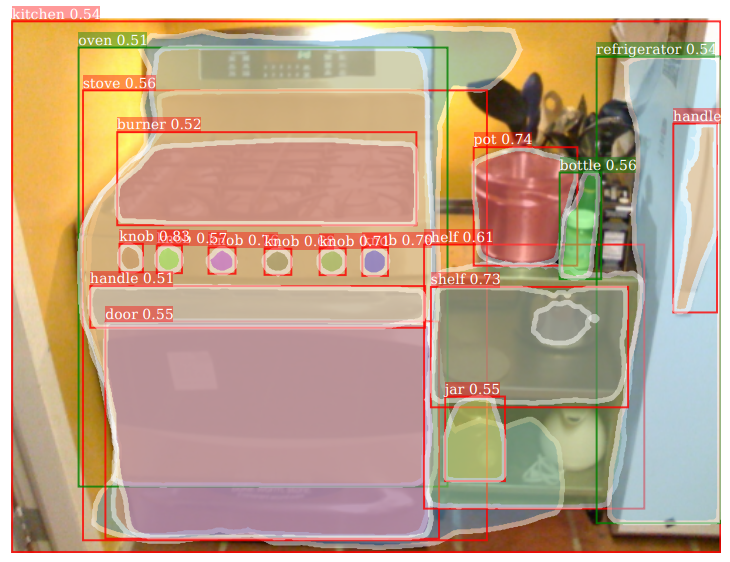
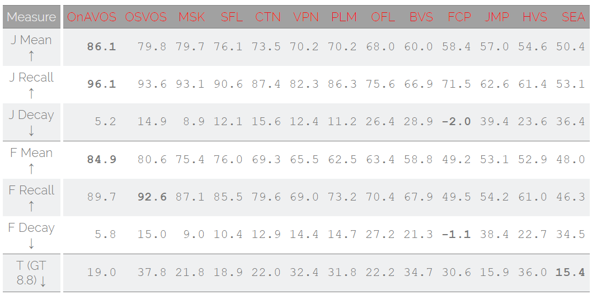

# Weak Supervised Semantic Segmentation list

This repository contains lists of state-or-art weak supervised semantic segmentation works. Papers and resources are listed below according to supervision types.
(on progress)

- [x] Paper list
	- [x] instance
	- [x] box
	- [ ] one-shot
	- [x] others 
- [x] Resources
- [ ] Survey

some unsupervised segment proposal methods and datasets [here](unsup.md).

#### Typical weak supervised segmentation problems 

| No | Supervision | Difficulty | Domain | Core issues |
| -- | ----------- | ---------- | ------ | ----------- |
| 1 | [Bounding box](#1) | middle | annotated classes | transfer learning |
| 2 | [One-shot segment](#2) | middle | similar objects | one-shot learning |
| 3 | [Image/video label](#3) | hard | annotated classes | transfer learning |
| 4 | [Others](#4) | n/a | n/a | n/a |

<h2 id="1">1.Bounding box supervision</h2>

Instance semantic segmentation

* [Learning to Segment Every Thing](https://arxiv.org/abs/1711.10370), CVPR 2018

	comments: learning weight transfer from well-annotated subset, transfer class-specific weights(output layers) from detection and classification branch, based on Mask-RCNN

* [Simple Does It: Weakly Supervised Instance and Semantic Segmentation](https://arxiv.org/abs/1603.07485), CVPR 2017 \[[web](https://www.mpi-inf.mpg.de/departments/computer-vision-and-multimodal-computing/research/weakly-supervised-learning/simple-does-it-weakly-supervised-instance-and-semantic-segmentation/)\] \[[code](https://github.com/philferriere/tfwss)\]\[[supp](http://openaccess.thecvf.com/content_cvpr_2017/supplemental/Khoreva_Simple_Does_It_2017_CVPR_supplemental.pdf)\]

	comments: Grabcut+(HED bounday) and MCG , train foreground segmentation network directly with generated mask

semantic segmentaion

* [Weakly- and Semi-Supervised Learning of a DCNN for Semantic Image Segmentation](https://arxiv.org/abs/1502.02734), ICCV 2015

	comments: based on CRF refine, EM do not works

* [BoxSup: Exploiting Bounding Boxes to Supervise Convolutional Networks for Semantic Segmentation](https://arxiv.org/abs/1503.01640), ICCV 2015

	comments: iterative updata para and region proposal label, hard to implement and tricky to select proposals.

* [Deepcut: Object segmentation from bounding box annotations using convolutional neural networks](https://pdfs.semanticscholar.org/9732/f55c55512309e24a88ae4f0728cc763b626f.pdf), TMI 2017

Arxiv paper

* [Learning to Segment via Cut-and-Paste](https://arxiv.org/abs/1803.06414), Arxiv 1803 

* [Pseudo Mask Augmented Object Detection](https://arxiv.org/abs/1803.05858), Arxiv 1803

* [Adversarial Learning for Semi-Supervised Semantic Segmentation](https://arxiv.org/abs/1802.07934), Arxiv1802

<h2 id="2">2.One-Shot segmentation supervision(TODO)</h2>

DAVIS Challenge: <http://davischallenge.org/>

* [OSVOS: One-Shot Video Object Segmentation](http://openaccess.thecvf.com/content_cvpr_2017/papers/Caelles_One-Shot_Video_Object_CVPR_2017_paper.pdf), CVPR 2017 \[[web](http://www.vision.ee.ethz.ch/~cvlsegmentation/osvos/)\]\[[code](https://github.com/kmaninis/OSVOS-caffe)\]

<h2 id="3">3.Image/video label supervision</h2>

* [Learning Pixel-level Semantic Affinity with Image-level Supervision for Weakly Supervised Semantic Segmentation](https://arxiv.org/abs/1803.10464), CVPR 2018
* [Multi-Evidence Filtering and Fusion for Multi-Label Classification, Object Detection and Semantic Segmentation Based on Weakly Supervised Learning](https://arxiv.org/abs/1802.09129), CVPR 2018
* [Weakly Supervised Semantic Segmentation using Web-Crawled Videos](https://arxiv.org/abs/1701.00352), CVPR 2017 \[[web](http://cvlab.postech.ac.kr/research/weaksup_video/)\]
* [Object Region Mining with Adversarial Erasing: A Simple Classification to Semantic Segmentation Approach](https://arxiv.org/abs/1703.08448), CVPR 2017
* [WILDCAT: Weakly Supervised Learning of Deep ConvNets for Image Classification, Pointwise Localization and Segmentation](http://webia.lip6.fr/~durandt/pdfs/2017_CVPR/Durand_WILDCAT_CVPR_2017.pdf), CVPR 2017 \[[web](http://webia.lip6.fr/~durandt/projects/wildcat/)\]\[[code](https://github.com/durandtibo/wildcat.pytorch)\]
* [Learning random-walk label propagation for weakly-supervised semantic segmentation](https://arxiv.org/abs/1802.00470), CVPR 2017 
* [Learning from Weak and Noisy Labels for Semantic Segmentation](http://ieeexplore.ieee.org/document/7450177/), PAMI 2017
* [Learning to Segment Human by Watching YouTube](https://arxiv.org/abs/1710.01457), PAMI 2017
* [Seed, Expand, Constrain: Three Principles for Weakly-Supervised Image Segmentation](https://arxiv.org/pdf/1603.06098.pdf), ECCV 2016 \[[code](https://github.com/kolesman/SEC)\]
* [Constrained Convolutional Neural Networks for Weakly Supervised Segmentation](https://www.robots.ox.ac.uk/~vgg/rg/papers/ccnn.pdf), ICCV 2015 \[[code](https://github.com/pathak22/ccnn)\]

<h2 id="4">4.Other supervision</h2>

#### Points

* [Deep Extreme Cut: From Extreme Points to Object Segmentation](https://arxiv.org/abs/1711.09081), Arxiv1711
* [What's the Point: Semantic Segmentation with Point Supervision](https://arxiv.org/abs/1506.02106), ECCV 2016 \[[web](http://vision.stanford.edu/whats_the_point/)\]\[[code](https://github.com/abearman/whats-the-point1)\] 

#### Scribbles

* [ScribbleSup: Scribble-Supervised Convolutional Networks for Semantic Segmentation](https://arxiv.org/abs/1604.05144), CVPR 2016
* [Learning to segment under various forms of weak supervision](https://www.cs.toronto.edu/~urtasun/publications/xu_etal_cvpr15.pdf), CVPR 2015

<h2 id="5">5.Close Related or unpublished work</h2>

* [On Regularized Losses for Weakly-supervised CNN Segmentation](https://arxiv.org/abs/1803.09569v1), Arxiv1803

* [Weakly-Supervised Action Segmentation with Iterative Soft Boundary Assignment](https://arxiv.org/abs/1803.10699v1), CVPR 2018

* [Cross-Domain Weakly-Supervised Object Detection through Progressive Domain Adaptation](https://arxiv.org/abs/1803.11365), CVPR 2018

* [Weakly Supervised Salient Object Detection Using Image Labels](https://arxiv.org/abs/1803.06503v1), Arxiv 1803

* [Weakly Supervised Object Localization on grocery shelves using simple FCN and Synthetic Dataset](https://arxiv.org/abs/1803.06813v1), Arxiv 1803

* [Learning Semantic Segmentation with Diverse Supervision](https://arxiv.org/abs/1802.00509), WACV 2018

**If some related works are missed, please kindly notice me by dxzhang@zju.edu.cn**

