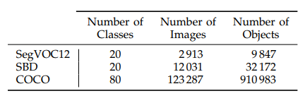

# Unsupervised region proposal methods 

* [GrabCut: Interactive foreground extraction using iterated graph cuts](https://cvg.ethz.ch/teaching/cvl/2012/grabcut-siggraph04.pdf), SIGGRAPH 2004

Grabcut variants: 

* [KernelCut:Secrets of GrabCut and Kernel K-means](https://www.cv-foundation.org/openaccess/content_iccv_2015/papers/Tang_Secrets_of_GrabCut_ICCV_2015_paper.pdf), ICCV 2015, \[[code](https://github.com/meng-tang/KernelCut_ICCV15)\]

* [DenseCut: Densely Connected CRFs for Realtime GrabCut](http://mftp.mmcheng.net/Papers/DenseCut.pdf), CGF 2015, \[[web](http://mmcheng.net/densecut/)\]

* [Onecut:grabcut in ont cut](http://www.csd.uwo.ca/~ygorelic/iccv13_one_cut.pdf),ICCV 2013, \[[code](https://github.com/meng-tang/OneCut)\] 

Others

* [MCG: Multiscale Combinatorial Grouping](https://arxiv.org/abs/1503.00848), CVPR 2014, \[[web](https://www2.eecs.berkeley.edu/Research/Projects/CS/vision/grouping/mcg/)\] \[[code](https://github.com/jponttuset/mcg)\]

* [Convolutional Oriented Boundaries](https://arxiv.org/abs/1701.04658), ECCV 2016, \[[web](http://www.vision.ee.ethz.ch/~cvlsegmentation/cob/)\]\[[code](https://github.com/kmaninis/COB)\]

Related datasets

* [BSDS500](https://www2.eecs.berkeley.edu/Research/Projects/CS/vision/grouping/resources.html)

* [the segmentation challenge of PASCAL 2012 Visual Object Classes\(SegVOC12\)](http://host.robots.ox.ac.uk/pascal/VOC/)

* [the Berkeley Semantic Boundaries Dataset\(SDB\)](http://home.bharathh.info/pubs/codes/SBD/download.html) 

* [Microsoft Common Objects in Context \(COCO\)](http://cocodataset.org/) 
